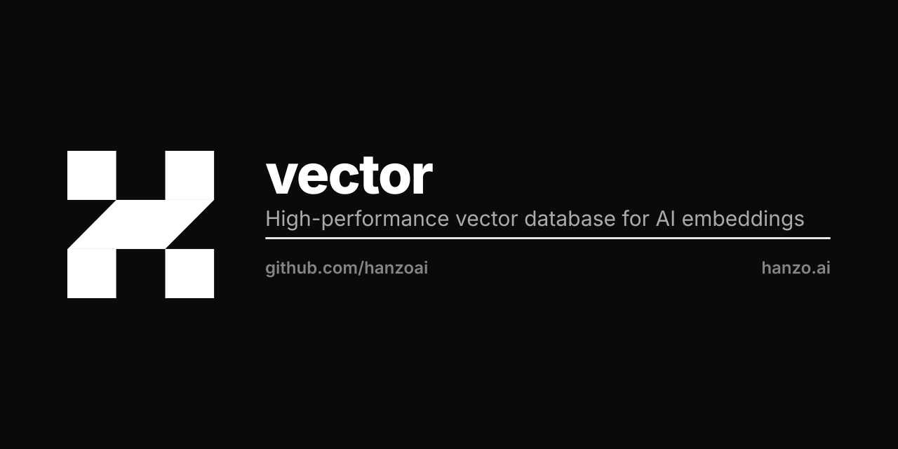

<p align="center"></p>

# Hanzo Vector

High-performance vector database for AI embeddings and similarity search.

## Overview

Hanzo Vector is a production-ready vector database optimized for AI workloads. It provides efficient storage and retrieval of high-dimensional vectors, enabling lightning-fast similarity search for embeddings generated by large language models, image encoders, and other AI systems.

## Features

- **High Performance**: Optimized HNSW indexing for fast approximate nearest neighbor search
- **Scalability**: Horizontal scaling with distributed architecture
- **Flexible Filtering**: Combine vector search with payload filtering
- **Multiple Distance Metrics**: Cosine, Euclidean, Dot Product
- **REST & gRPC APIs**: Easy integration with any language
- **Cloud Native**: Kubernetes-ready with Helm charts

## Quick Start

```bash
docker run -p 6333:6333 -p 6334:6334 hanzo/vector
```

## Documentation

See the [documentation](https://hanzo.ai/docs/vector) for detailed guides and API reference.

## Source

The engine lives on the `master` branch. This branch carries the project
description only.

## License

Apache-2.0 - see [LICENSE](LICENSE) for details.

Hanzo Vector is derived from [Qdrant](https://github.com/qdrant/qdrant),
which is Apache-2.0. See [NOTICE](NOTICE) for attribution.
